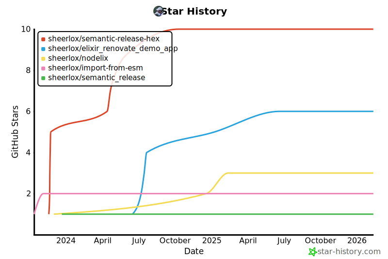
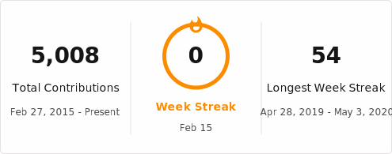

<h2 style="display:inline" align="center">🕵️ Hello there, welcome to my GitHub! 👋</h2>
 

    
    
    
    
    

---

<ul>
    <li>👴 passionate about building stuff on computers for 13+ years (2010)</li>
    <li>🗣 Javascript/Typescript Lead Developer for 8+ years (2015)</li>
    <li>🧑‍💻 strong inclination toward backend development</li>
    <li>💜 currently learning Elixir</li>
    <li>👷 currently building <a href="https://github.com/Talent-Ideal">@Talent-Ideal</a></li>
    <li>🧑‍🏫 part-time university instructor</li>
    <li>🫶 low-key FOSS maintainer</li>
</ul>

---

  
  
  

---

#### 🫶 Recent contributions

- [talent-insights/semantic-release-hex](https://github.com/talent-insights/semantic-release-hex) - 🚢 semantic-release plugin to publish a hex package (3 weeks ago)
- [talent-insights/semantic_release](https://github.com/talent-insights/semantic_release) - 📦🚀 Fully automated version management and package publishing for Elixir (4 months ago)
- [sheerlox/nodelix](https://github.com/sheerlox/nodelix) - Seamless Node.js in Elixir (4 months ago)
- [sheerlox/elixir_renovate_demo](https://github.com/sheerlox/elixir_renovate_demo) - A repository showcasing using Renovate on an Elixir project (4 months ago)
- [containerbase/base](https://github.com/containerbase/base) - The containerbase project&#39;s base image source (4 months ago)
- [insurgent-lab/.github](https://github.com/insurgent-lab/.github) - Common configuration for the Insurgent Lab organization (4 months ago)
- [insurgent-lab/commitlint-config](https://github.com/insurgent-lab/commitlint-config) - commitlint config for @insurgent/conventional-changelog-preset (4 months ago)
- [sheerlox/import-from-esm](https://github.com/sheerlox/import-from-esm) - Almost drop-in &#34;import-from&#34; replacement that supports loading both ESM &amp; CJS modules (4 months ago)
- [sheerlox/cron-comparison](https://github.com/sheerlox/cron-comparison) - Automated benchmark of all JavaScript cron implementations (4 months ago)
- [sheerlox/auto_grader](https://github.com/sheerlox/auto_grader) - An automatic assignments grading program written in Elixir (4 months ago)
- [ash-project/ash](https://github.com/ash-project/ash) - A declarative, extensible framework for building Elixir applications. (5 months ago)
- [sheerlox/gpg_ex](https://github.com/sheerlox/gpg_ex) - A simple wrapper to run GPG commands. (6 months ago)
- [sheerlox/vscode-settings](https://github.com/sheerlox/vscode-settings) -  (6 months ago)
- [sheerlox/StackOverflow-Answers-Code](https://github.com/sheerlox/StackOverflow-Answers-Code) -  (6 months ago)
- [badges/shields](https://github.com/badges/shields) - Concise, consistent, and legible badges in SVG and raster format (6 months ago)
- [insurgent-lab/javascript-lib-template](https://github.com/insurgent-lab/javascript-lib-template) - A GitHub repository template for Open Source (ESM) JavaScript libraries following best practices. (6 months ago)
- [insurgent-lab/subpaths-test](https://github.com/insurgent-lab/subpaths-test) - Package that exposes various subpath-accessible modules for testing purposes. (6 months ago)
- [open-teach-lab/TP_Mock_Solution](https://github.com/open-teach-lab/TP_Mock_Solution) -  (6 months ago)
- [open-teach-lab/TP_Mock_starter](https://github.com/open-teach-lab/TP_Mock_starter) -  (6 months ago)
- [sheerlox/ash_manage_relationship_update_repro](https://github.com/sheerlox/ash_manage_relationship_update_repro) -  (7 months ago)

#### ⭐ Recent stars

- [leon-ai/leon](https://github.com/leon-ai/leon) - 🧠 Leon is your open-source personal assistant. (1 week ago)
- [dashbitco/nimble_csv](https://github.com/dashbitco/nimble_csv) - A simple and fast CSV parsing and dumping library for Elixir (2 weeks ago)
- [wakatime/browser-wakatime](https://github.com/wakatime/browser-wakatime) - Chrome extension for automatic time tracking and metrics generated from your browsing activity. (2 weeks ago)
- [kynan/nbstripout](https://github.com/kynan/nbstripout) - strip output from Jupyter and IPython notebooks (2 weeks ago)
- [wakatime/jupyterlab-wakatime](https://github.com/wakatime/jupyterlab-wakatime) - WakaTime for JupyterLab (3 weeks ago)
- [elixir-explorer/explorer](https://github.com/elixir-explorer/explorer) - Series (one-dimensional) and dataframes (two-dimensional) for fast and elegant data exploration in Elixir (3 weeks ago)
- [plgrazon/Raect](https://github.com/plgrazon/Raect) - I think you misspelled React. (3 weeks ago)
- [talent-insights/skill_sanity](https://github.com/talent-insights/skill_sanity) - Skill name standardization API for tech recruitment platforms (4 weeks ago)
- [williamboman/mason-lspconfig.nvim](https://github.com/williamboman/mason-lspconfig.nvim) - Extension to mason.nvim that makes it easier to use lspconfig with mason.nvim. (1 month ago)
- [vercel/resolve-node](https://github.com/vercel/resolve-node) - API endpoint to resolve an arbitrary Node.js version with semver support (3 months ago)

---

    

---

  

  

---

    

