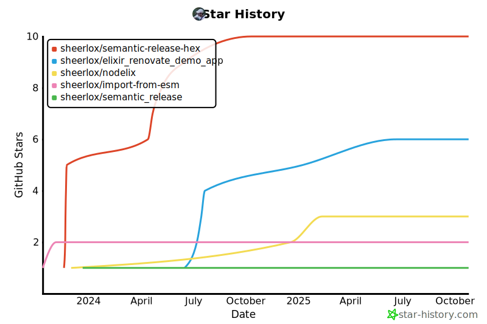

<h2 style="display:inline" align="center">🕵️ Hello there, welcome to my GitHub! 👋</h2>
 

    
    
    
    
    

---

<ul>
    <li>👴 passionate about building stuff on computers for 13+ years (2010)</li>
    <li>🗣 Javascript/Typescript Lead Developer for 8+ years (2015)</li>
    <li>💜 currently learning Elixir</li>
    <li>🧑‍💻 strong inclination toward backend development</li>
    <li>👷 co-founder & CTO <a href="https://github.com/Talent-Ideal">@Talent-Ideal</a></li>
    <li>🧑‍🏫 part-time university instructor</li>
    <li>🫶 low-key FOSS maintainer</li>
</ul>

---

  
  
  

---

#### 🫶 Recent contributions

- [sheerlox/auto_grader](https://github.com/sheerlox/auto_grader) - An automatic grader framework written in Elixir (2 days ago)
- [insurgent-lab/.github](https://github.com/insurgent-lab/.github) - Common configuration for the Insurgent Lab organization (4 weeks ago)
- [talent-ideal/semantic-release-hex](https://github.com/talent-ideal/semantic-release-hex) - 🚢 semantic-release plugin to publish a hex package (4 weeks ago)
- [ash-project/ash](https://github.com/ash-project/ash) - A declarative, extensible framework for building Elixir applications. (4 weeks ago)
- [talent-ideal/semantic_release](https://github.com/talent-ideal/semantic_release) - 📦🚀 Fully automated version management and package publishing for Elixir (1 month ago)
- [sheerlox/nodelix](https://github.com/sheerlox/nodelix) - Seamless Node.js in Elixir (1 month ago)
- [sheerlox/gpg_ex](https://github.com/sheerlox/gpg_ex) - A simple wrapper to run GPG commands. (1 month ago)
- [sheerlox/vscode-settings](https://github.com/sheerlox/vscode-settings) -  (1 month ago)
- [sheerlox/StackOverflow-Answers-Code](https://github.com/sheerlox/StackOverflow-Answers-Code) -  (1 month ago)
- [badges/shields](https://github.com/badges/shields) - Concise, consistent, and legible badges in SVG and raster format (1 month ago)
- [insurgent-lab/javascript-lib-template](https://github.com/insurgent-lab/javascript-lib-template) - A GitHub repository template for Open Source (ESM) JavaScript libraries following best practices. (1 month ago)
- [insurgent-lab/subpaths-test](https://github.com/insurgent-lab/subpaths-test) - Package that exposes various subpath-accessible modules for testing purposes. (1 month ago)
- [sheerlox/import-from-esm](https://github.com/sheerlox/import-from-esm) - Almost drop-in &#34;import-from&#34; replacement that supports loading both ESM &amp; CJS modules (1 month ago)
- [open-teach-lab/TP_Mock_Solution](https://github.com/open-teach-lab/TP_Mock_Solution) -  (1 month ago)
- [open-teach-lab/TP_Mock_starter](https://github.com/open-teach-lab/TP_Mock_starter) -  (1 month ago)
- [sheerlox/cron-comparison](https://github.com/sheerlox/cron-comparison) - Automated benchmark of all JavaScript cron implementations (1 month ago)
- [sheerlox/ash_manage_relationship_update_repro](https://github.com/sheerlox/ash_manage_relationship_update_repro) -  (2 months ago)
- [sheerlox/ash_manage_relationship_update_repro_phoenix](https://github.com/sheerlox/ash_manage_relationship_update_repro_phoenix) -  (2 months ago)
- [elixir-ecto/ecto](https://github.com/elixir-ecto/ecto) - A toolkit for data mapping and language integrated query. (3 months ago)
- [insurgent-lab/is-in-pr-action](https://github.com/insurgent-lab/is-in-pr-action) - Github Action for checking if the current commit is part of a PR (3 months ago)

#### ⭐ Recent stars

- [membraneframework/bunch](https://github.com/membraneframework/bunch) - A bunch of helper functions, intended to make life easier (3 days ago)
- [keephq/keep](https://github.com/keephq/keep) - The open-source alert management and AIOps platform (6 days ago)
- [ThePrimeagen/harpoon](https://github.com/ThePrimeagen/harpoon) (1 week ago)
- [hrsh7th/nvim-cmp](https://github.com/hrsh7th/nvim-cmp) - A completion plugin for neovim coded in Lua. (1 week ago)
- [h4cc/awesome-elixir](https://github.com/h4cc/awesome-elixir) - A curated list of amazingly awesome Elixir and Erlang libraries, resources and shiny things. Updates: (1 week ago)
- [rose-pine/google-chrome](https://github.com/rose-pine/google-chrome) - Soho vibes for Google Chrome (1 week ago)
- [annappropriate/rose-pine-tilix](https://github.com/annappropriate/rose-pine-tilix) - Soho vibes for Tilix (1 week ago)
- [rose-pine/neovim](https://github.com/rose-pine/neovim) - Soho vibes for Neovim (1 week ago)
- [lewis6991/gitsigns.nvim](https://github.com/lewis6991/gitsigns.nvim) - Git integration for buffers (1 week ago)
- [folke/lazy.nvim](https://github.com/folke/lazy.nvim) - 💤 A modern plugin manager for Neovim (1 week ago)

---

    

---

  

  

---

    

